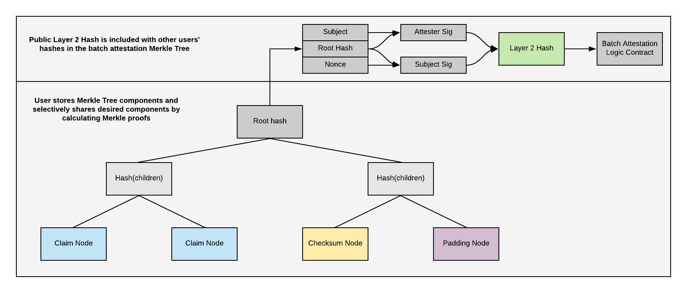
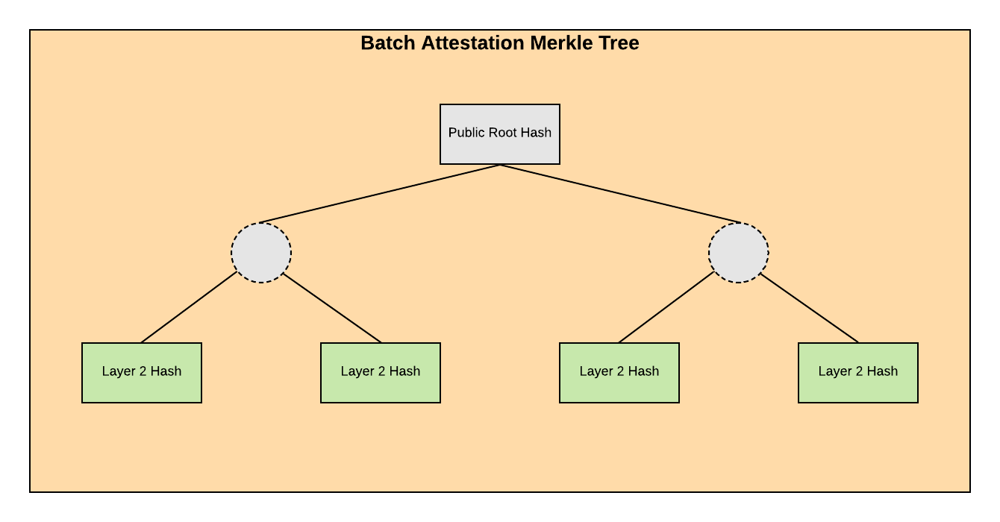

<!--You can leave these HTML comments in your merged BLIP and delete the visible duplicate text guides, they will not appear and may be helpful to refer to if you edit it again. This is the suggested template for new BLIPs. Note that a BLIP number will be assigned by an editor. When opening a pull request to submit your BLIP, please use an abbreviated title in the filename, `blip-draft_title_abbrev.md`. The title should be 44 characters or less.-->

## Simple Summary
<!--"If you can't explain it simply, you don't understand it well enough." Provide a simplified and layman-accessible explanation of the BLIP.-->
Scale attestation by batching multiple attestations in the same transaction. Structure the layer-2 datahash from the Selective Disclosure Merkle Tree spec into a batch attestations Merkle Tree. Emit the root hash of the batch attestations Merkle Tree through a new Attestation Logic smart contract.

## Abstract
<!--A short (~200 word) description of the technical issue being addressed.-->
Bloom currently submits one transaction per attestation and pays all of the transaction fees for the users. The cost to run the Attestation Logic smart contract scales linearly with user acquisition. A new smart contract should be developed and the attestation data structure should be updated so multiple attestations can be included in each transaction while meeting the following requirements:

* The same or greater user privacy as the current implementation
* Constant gas costs with respect to user acquisistion
* Trustless implementation so Bloom has no administrative control that is not available to any other 3rd party

The current Attestation Logic smart contract enables attesters to receive payment in BLT in the same transaction in which they submit the attestation. This update decouples BLT payments from attestation completion and requires off chain payment negotiation between requester and attester.

This update would change the primary smart contract Bloom uses to record attestations but it does not deprecate the previous Attestation Logic smart contract. Both versions may exist and provide useful functionality.

## Motivation
<!--The motivation is critical for BLIPs that want to change the Bloom protocol. It should clearly explain why the existing protocol specification is inadequate to address the problem that the BLIP solves. BLIP submissions without sufficient motivation may be rejected outright.-->
### Scaling Costs
Each attestation transaction currently costs ~100000 gas. At an average of 5 gwei each attestation costs Bloom 0.0005 Eth. Recently Bloom has been averaging 5000 attestations per day leading to a daily cost of 2.5 eth. This cost will continue increasing as Bloom acquires users at a faster rate. Fluctuating gas price and Eth/ USD prices also contribute to cost uncertainty. This proposal only addresses fixing the per-user attestation costs.

### Enhanced Privacy
The current Attestation Logic contract makes the following information public in an event.

* Subject: Ethereum address of user (iOS HD wallet, Android HD wallet, Metamask or other)
* Requester: Ethereum address of entity requesting the attestation be completed
* Attester: Ethereum address of entity completing attestation
* DataHash: Root hash of Selective Disclosure Merkle Tree

With this information public, it increases the user's exposure to correlation attacks. An adversary could collect all the metadata about requesters, attesters and subjects and start to build profile data about the subject. This update would move the subject, requester and attester information into the attestation data structure to further enhance user privacy.

The DataHash is sufficiently obfuscated to be pre-image attack resistant.


## Specification
<!--The technical specification should describe the syntax and semantics of any new feature. The specification should be detailed enough to allow competing, interoperable implementations for any of the current Bloom platforms.-->

### BatchAttestationLogic.sol
Introduce BatchAttestationLogic.sol contract to emit batched attestations for attesters.
```
/**
 * @title BatchAttestationLogic
 * @notice AttestationLogic allows users to submit the root hash of a batch
 *  attestation Merkle tree
 */
contract BatchAttestationLogic {
  event BatchTraitAttested(
    bytes32 rootHash
    );

  /**
   * @notice Function for anyone to submit the root hash of a batch attestation merkle tree
   * @param _dataHash Root hash of batch merkle tree
   */
  function batchAttest(
    bytes32 _dataHash
  ) external {
    emit BatchTraitAttested(_dataHash);
  }
}
```

### Layer 2 Hash V2
The full change is available in the PR here: https://github.com/hellobloom/specs/pull/2

The layer 2 hash of a Selective Disclosure Merkle Tree can be formed using the combined hash of the Subject's signature and the Attester's signature. These signatures take the place of on chain signature validation logic. The new layer 2 hash can be structured into a large Batch Attestation Merkle Tree. The root hash of that tree is published on chain. Users can prove inclusion of their layer 2 hash in the larger tree.




    const layer2Hash = hashMessage(
        orderedStringify({
          attesterSig: attesterSig,
          subjectSig: subjectSig
        })
      )

Layer 2 hashes are sorted alphabetically, combined into a batch Merkle Tree then the root of the batch Merkle tree is emitted on chain. Batch Merkle trees are published regularly (every 4 blocks).



## Rationale
<!--The rationale fleshes out the specification by describing what motivated the design and why particular design decisions were made. It should describe alternate designs that were considered and related work, e.g. how the feature is supported in other languages. The rationale may also provide evidence of consensus within the community, and should discuss important objections or concerns raised during discussion.-->

## Attester Signature
The attester used to signal their approval of the attestation for a specific subject by submitting the transaction on chain with the subject address in the attestation function arguments. Now that the subject is in the Merkle Tree, not on chain, the attester needs to sign an additional message approving of the specific data hash associated with the specific subject. This signature is included in the Merkle Tree and must be checked by verifiers to make sure shared data is valid.

## Subject Signature
The subject signature has remained the same as the previous implementation in order to minimize the changes needed to the specification implementations. The subject signature used to be validated in the smart contract. Now it is validated off chain and included in the Merkle Tree. Verifiers will need to ensure the subject signature is valid when they receive shared data.

```
export const getFormattedTypedDataAttestationRequest = (
  contractAddress: string,
  chainId: number,
  dataHash: string,
  requestNonce: string
): IFormattedTypedData => {
  return {
    types: {
      EIP712Domain: [
        {name: 'name', type: 'string'},
        {name: 'version', type: 'string'},
        {name: 'chainId', type: 'uint256'},
        {name: 'verifyingContract', type: 'address'},
      ],
      AttestationRequest: [
        {name: 'dataHash', type: 'bytes32'},
        {name: 'nonce', type: 'bytes32'},
      ],
    },
    primaryType: 'AttestationRequest',
    domain: {
      name: 'Bloom Attestation Logic',
      version: '2',
      chainId: chainId,
      verifyingContract: contractAddress,
    },
    message: {
      dataHash: dataHash,
      nonce: requestNonce,
    },
  }
}
```


## Backwards Compatibility
<!--All BLIPs that introduce backwards incompatibilities must include a section describing these incompatibilities and their severity. The BLIP must explain how the author proposes to deal with these incompatibilities. BLIP submissions without a sufficient backwards compatibility treatise may be rejected outright.-->
This change involves deploying a new smart contract for submitting attestations. Share Kit endpoint validation logic needs to be updated to work with the new contract. The current contract can still be used for submitting individual attestations and revocations.

The new Selective Disclosure Merkle Tree is intended to be backwards compatible with the previous one. The only difference is how the Layer 2 Hash is formed.

The subject signature is the same for both implementations of the Selective Disclosure Merkle Tree. This way the subject does not have to care if they are giving permission to be part of a batch of attestations or an individual attestation.

## Test Cases
<!--Test cases for an implementation are mandatory for BLIPs that are affecting governance changes. Other BLIPs can choose to include links to test cases if applicable.-->
Test cases will be covered in the test for `HashingLogic.ts` in `Attestations-Lib`.

## Implementation
<!--The implementations must be completed before any BLIP is given status "Final", but it need not be completed before the BLIP is accepted. While there is merit to the approach of reaching consensus on the specification and rationale before writing code, the principle of "rough consensus and running code" is still useful when it comes to resolving many discussions of API details.-->

## Copyright
Copyright and related rights waived via [CC0](https://creativecommons.org/publicdomain/zero/1.0/). Based on the Ethereum Improvement Proposal template.
